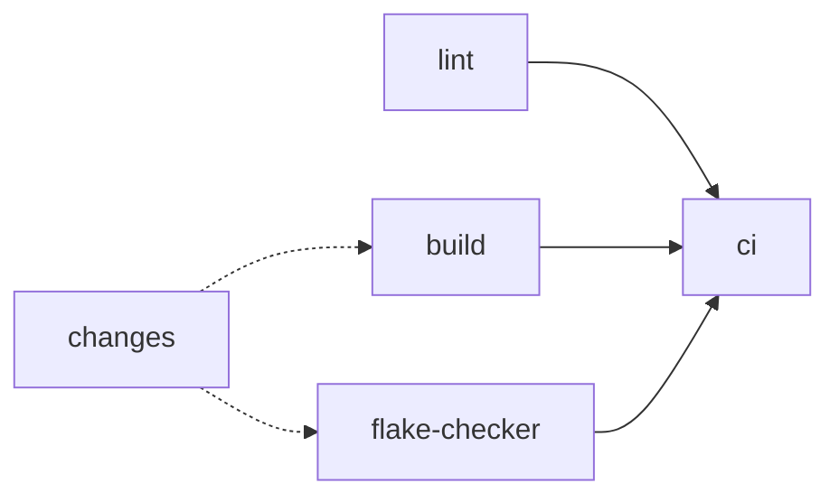

# home-manager

## what

My setup for [Home Manager](https://nix-community.github.io/home-manager/)

## why

It's very handy to be able to have consistency across different machines

## how

### development

Make changes as needed and test on the local machine e.g `home-manager switch --flake .#otto@aarch64-darwin`

Alternatively, `nix develop` opens a shell with `prek` and all code-quality tools available without applying the full config — useful for working on this repo on a fresh clone or in CI.

### normal use

Anywhere this is used, entering `switch` into the terminal will link to the `main` branch of this repo and update the settings

## CI

The `ci` job is required to pass before merging to `main`, enforced by the org-level ruleset in [github-settings](https://github.com/ojhermann-org/github-settings). A preceding `changes` job diffs the PR to decide which downstream jobs need to run: `build` skips on non-Nix PRs, `flake-checker` skips unless `flake.nix` or `flake.lock` changed, and `lint` always runs (its hooks self-filter per file type). `ci` treats skipped jobs as passing.

